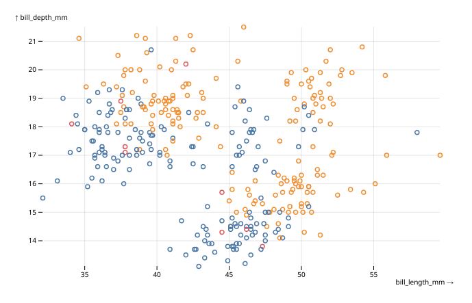
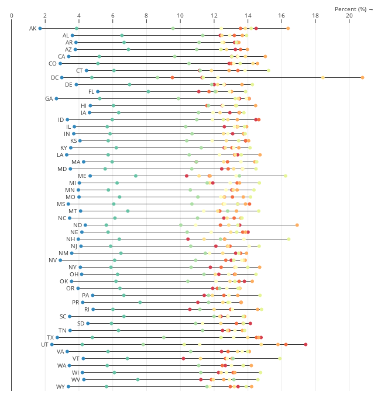

<!-- badges: start -->
[](https://www.tidyverse.org/lifecycle/#maturing)
[](https://github.com/juba/obsplot/actions)
<!-- badges: end -->

# Obsplot

`obsplot` is an experimental attempt at using [Observable Plot](https://observablehq.com/@observablehq/plot) directly from R.

Please note that the package is in an early stage. Its API is subject to breaking changes, there are bugs, and maybe bad design choices. But if you still want to try the package, issues and feedback are very welcome !

Also note that `obsplot` doesn't work in the RStudio viewer for now on, due to an outdated web rendering engine. You can either open the visualisation in a recent browser, or use [R in VSCode](https://github.com/REditorSupport/vscode-R).

## Examples

Here is a small example of a simple scatterplot from the `penguins` dataset of the `palmerpenguins` package :

```r
library(palmerpenguins)
data(penguins)

obsplot(penguins) |>
    mark_dot(x = "bill_length_mm", y = "bill_depth_mm", stroke = "sex") |>
    opts(grid = TRUE)
```



And here is a much more complex example taken from Observable Plot documentation :

```r
data(stateage)

xy <- transform_normalizeX(basis = "sum", z = "name", x = "population", y = "name")

obsplot(stateage, height = 660) |>
    mark_ruleX(x = 0) |>
    mark_ruleY(
        transform_groupY(list(x1 = "min", x2 = "max"), xy)
    ) |>
    mark_dot(xy, fill = "age", title = "age") |>
    mark_text(
        transform_selectMinX(xy), textAnchor = "end", dx = -6, text = "name"
    ) |>
    scale_x(
        axis = "top",   label =  "Percent (%) →", 
        transform = JS("d => d * 100")
    ) |>
    scale_y(axis = NULL) |>
    scale_color(scheme = "spectral", domain = unique(stateage$age)) |>
    opts(grid = TRUE)
```



You will find many more examples in the two gallery vignettes :

- [marks gallery](https://juba.github.io/obsplot/articles/gallery_marks.html)
- [facets and transforms gallery](https://juba.github.io/obsplot/articles/gallery_transforms.html)

To get started, take a look at the [introduction vignette](https://juba.github.io/obsplot/articles/introduction.html).

## Installation

From Github :

```r
remotes::install_github("juba/obsplot")
```

From [R-universe](https://r-universe.dev/organizations/) :

```r
install.packages("obsplot", repos = "https://juba.r-universe.dev")
```

## Credits

- Obviously, the [Observable Plot](https://observablehq.com/@observablehq/plot) library developed by [Mike Bostock](https://observablehq.com/@mbostock) and [Philippe Rivière](https://observablehq.com/@fil/) at [Observable](https://observablehq.com/).
- The [htmlwidgets](https://www.htmlwidgets.org/) package, which does all the heavy work to bridge R and JavaScript.
- [John Coene](https://twitter.com/jdatap) for the [packer](https://github.com/JohnCoene/packer) package, the [JavaScript for R](https://book.javascript-for-r.com/) book and the [g2r](https://github.com/devOpifex/g2r/) package which is a great source of inspiration.
